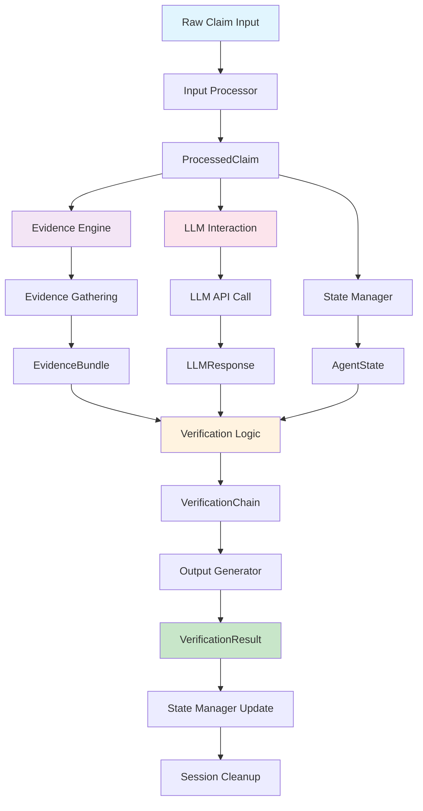
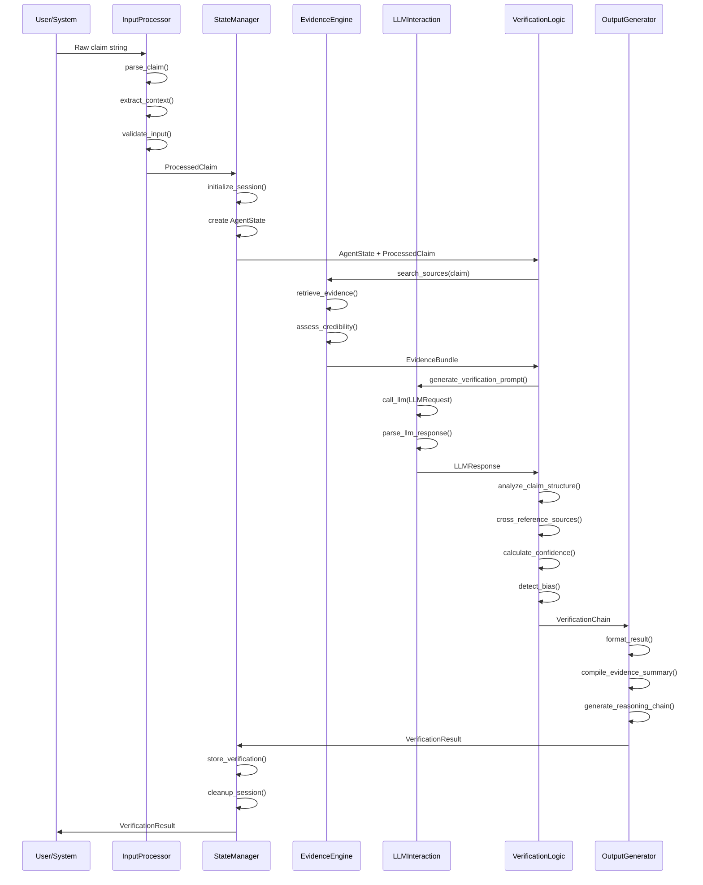
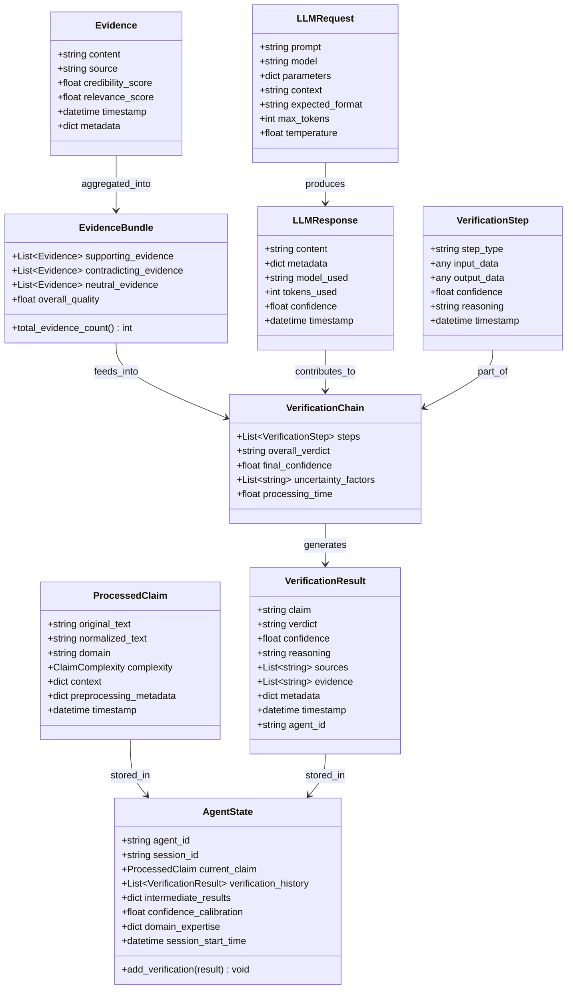
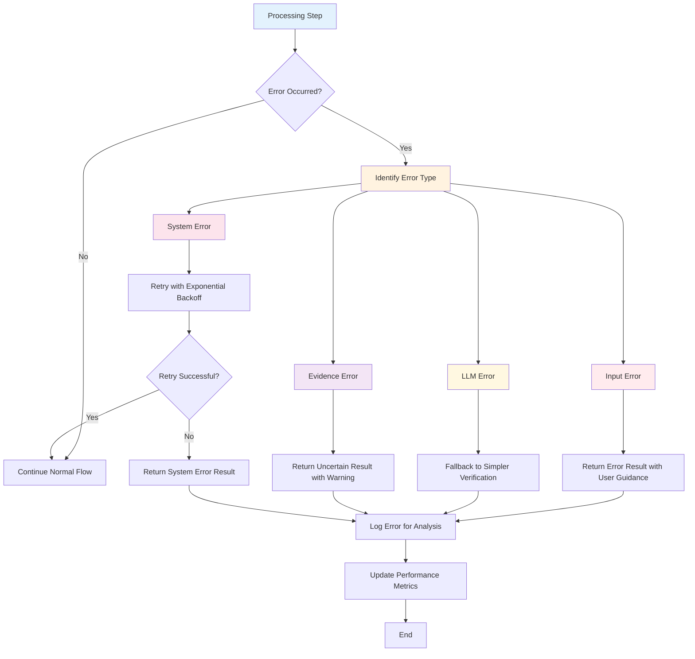
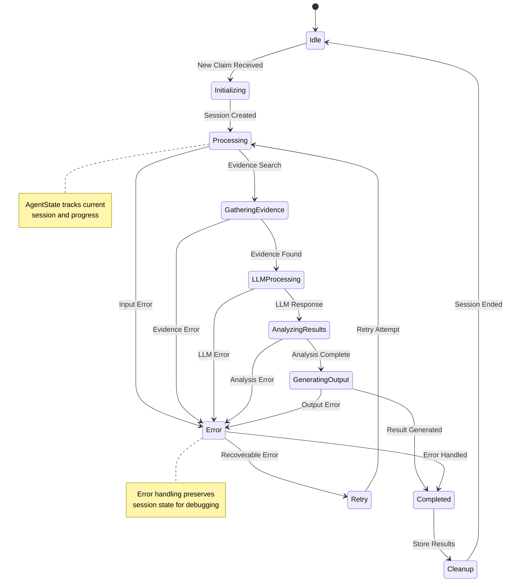
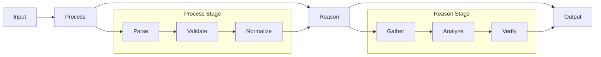
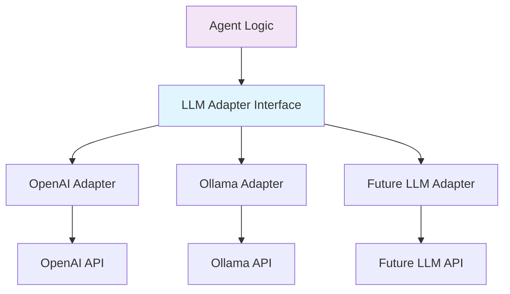
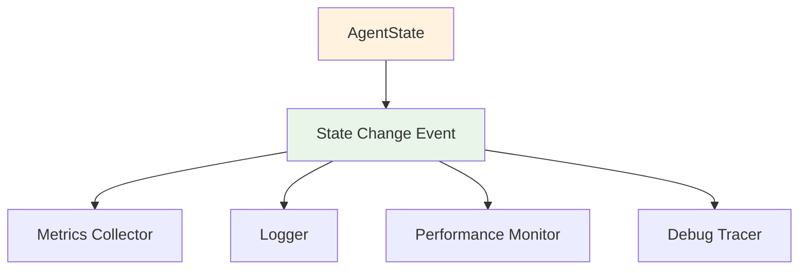
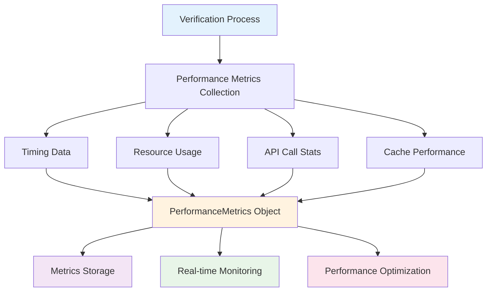
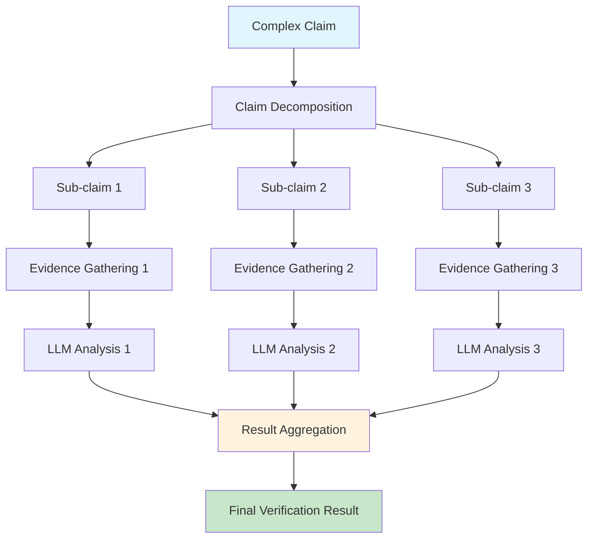

# Agent Data Flow Visualization

This document provides detailed visualizations of data flow within the Core AI Agent Architecture, complementing the main [core-agent-architecture.md](./core-agent-architecture.md) document.

## Component Interaction Flow

## Detailed Process Flow with Data Structures

## Data Structure Relationships

## Error Handling Flow

## State Management Lifecycle

## Component Integration Patterns

### 1. Pipeline Pattern (Main Flow)

### 2. Adapter Pattern (LLM Integration)

### 3. Observer Pattern (State Management)

## Performance and Monitoring Data Flow

## Parallel Processing Flow

For complex claims requiring multiple verification approaches:

---

These diagrams provide visual representations of the data flow patterns described in the core agent architecture documentation, helping developers understand the relationships between components and the flow of information through the verification process.